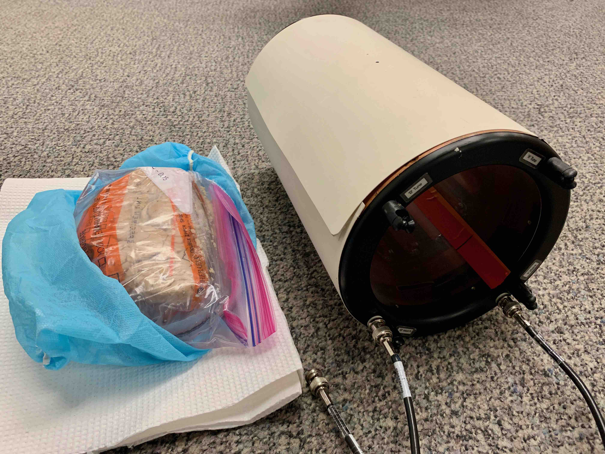
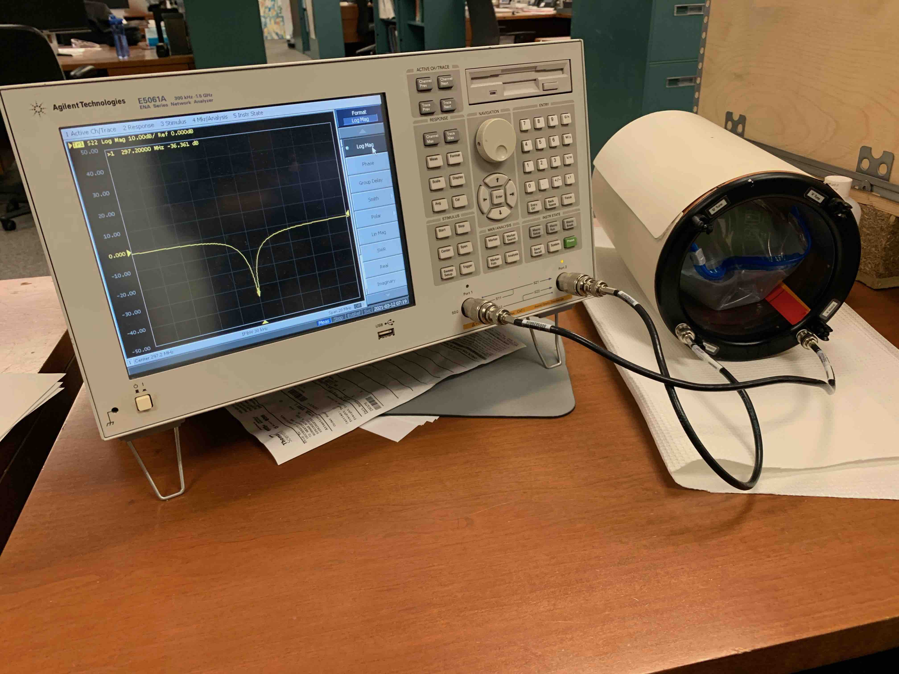
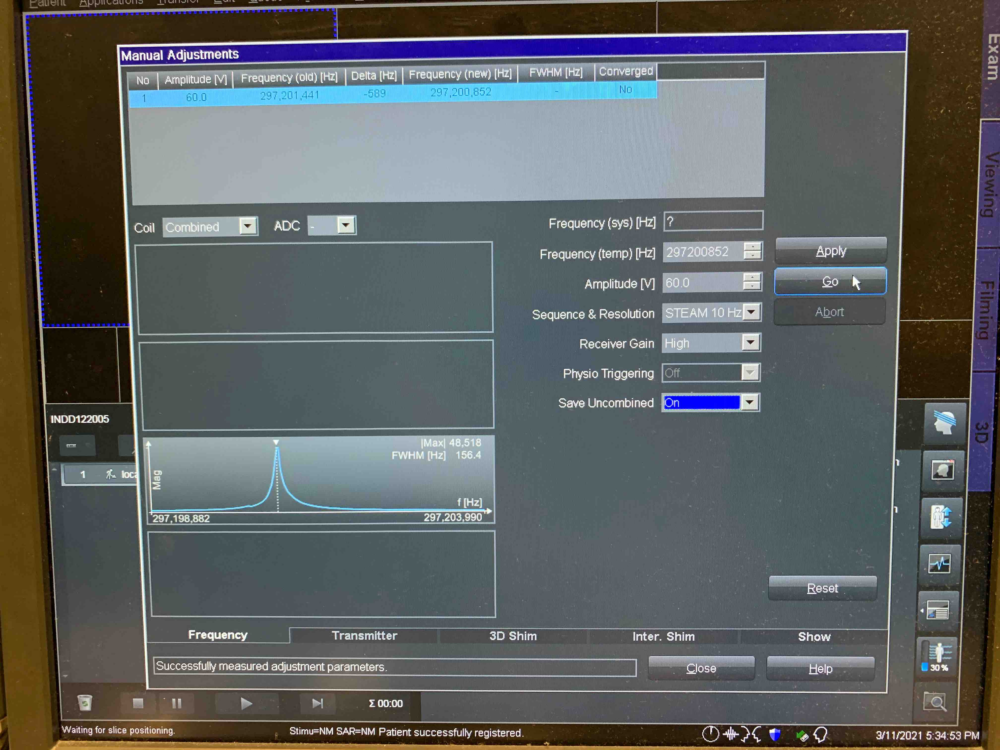
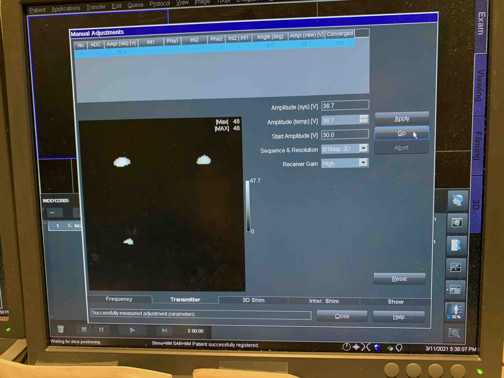
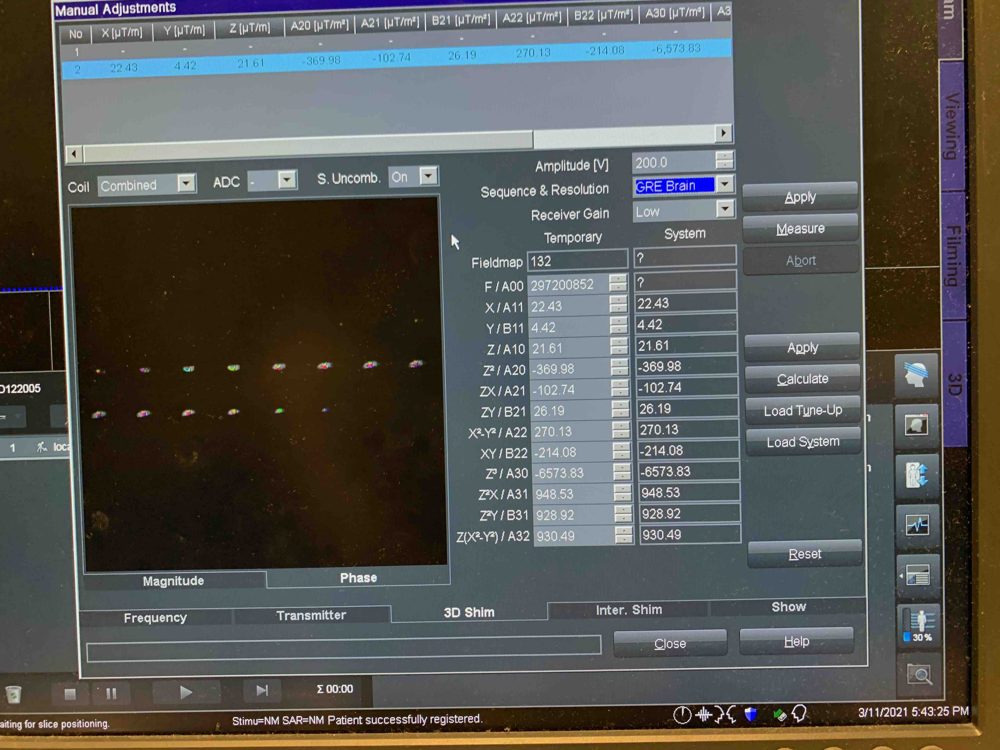

## Introduction

We currently scan human hemispheres using the 7T scanner at Stellar Chance. Below is the process for these experiments.

## Getting the Sample

Samples are picked up from CRB 270/280. Access is through the door for CRB 250. Confirm with [#proj_exvivo_mri](slack://channel?team=TA20HKQ5R&id=CQ1TPBN9J) Slack channel for sample availability.

When you pick up the sample, the INDD# will be written on the sample bag. Copy down the INDD # in a second location, as you will not be able to see it on the bag once you load the sample in the coil.

## Setting up the coil

The coil will be stored on Karthik's desk in CMROI. **Be careful** the coil has fomblin on its surface (more on the inside) and you'll want to wear gloves when handling it.

Look inside the coil and note the "stripes" inside running the length of the coil. These are transmit/receive elements. Note they are not the same length as the coil shell, nor are they centered in the coil shell.

Load the sample into the coil. Position it such that it's centered within the transmit/receive elements (not the coil shell!). 

Bring the loaded coil to the network analyzer in CMROI (there should be a piece of protective paper on the desk, if not, get one from CMROI so we don't make a fomblin mess in CMROI). Turn on the network analyzer and attach both coax cables to the network analyzer in CRMOI.

Use the Center button to recenter the visible display spectrum. After pressing Center, enter 297.2 on the numberpad and press the M/u button to make the value MHz.

Use the Span button to change the width of the displayed spectrum. After pressing Span, enter 20 on the number bad an dpress the M/u button to make the value MHz.

Use the Marker button to make an arrow marker for the desired center frequency. After pressing the Marker button, enter 297.2 on the numberpad and press M/u button to make the value MHz.

Use the Meas button to chose which channel you are measuring. After pressing the Meas button, Press S11 on the screen to choose the first channel. Note which channel on the coil (A or B) is connected to Port 1 on the analyzer.

Use the Format button to chose the display format. After pressing the Format button,choose "Smith" and then "Real/Imag" from the on screen options.

Turn the "Tune" and "Match" knobs on the coil for the channel that is actively being displayed. Your goal is to move the arrow to the origin of the Smith plot.

Use the Meas button to chose the second channel to measure but selecting "S22" from the onscreen options.

Use the "Tune" and "Match" knobs as above.

Change back to the first channel and repeat adjustments, the repeat for the second channel until both are well-centered.

Turn off the network analyzer by just pressing the power button and disconnect the coil.

## Setting up the scanner

Prop open the doors to the 7T scanner room, as it's annoying to carry the coil and open the doors at the same time.

Get the "Helmut Box" from the upper shelf, and attach just the left-most (proton) cable to the table at jack #1. Check that the box shows up on the scanner display as properly attached.

Put two blue foam "sheets" down on top of the standard spine pad. Get two of the stabilizing straps and attach them to the table in advance.

Go get the coil (wear gloves!) and put it down on the blue foam "sheets", facing with its coax cables towards the bore.

Attach the coax cables to the proton connection points of the "Helmut box", and secure the coil with the straps.

Localize the coil on the black dot, using the laser marker (recenter the coil manually as needed), and send it to isocenter.

## Scanning protcol

Register the subject as `INDD<INDD#>`. Enter a made-up DOB, height and weight.

Select the protocol `Research > DTisdall > Ex-vivo_20200106`

Deselect `Load Program to Queue`

Add study comment `7THemi_INDD<INDD#>_<YYYYMMDD>@cfn:pmc_exvivo`

Set body part to `Brain` if not automatically selected

Make sure both channels are turned on.

## Scanning Procedure

Select Localizer from `Research > DTisdall > Ex-vivo_20200106` folder.

Open localizer protocol (has to be open for adjustments to be active)

Options > Adjustments

The adjustments are done in **Frequency, Transmitter and 3D Shim**  cards.

**Frequency  Card**

Hit  Go -> Apply (make sure it converges, might need to repeat a few times) 

**Transmitter Card** 

Select  'Double Echo Sequence'  from drop down menu.

Starting Voltage can be set to 30 V.

Hit Go > Apply. 

Voltage should be below 70, otherwise there is an issue and you should not proceed with the scan! 

**3D Shim Card** 

Select from drop down menues: 

Sequence & Resolution: GRE-Brain  
Reciever Gain: Low

Manually type in the Voltage amplitude from Transmitter Card for best shimming results (light blue homogeneous phase maps).

Measure > Calculate > Apply

Repeat several times, periodically switch to Frequency tab and hit go. Monitor the FWHM changes ( < 80 OK). Make sure it converges.

Check that both coils are on, then RUN the localizer.

Inspect the localizer images and the slab location box. Move the box to the center of the tissue. 'Window' the localizer images to see the tissue boundaries and check for signal dropout. If necessary move the sample to make sure there are no signal dropout regions. Sometimes if the sample is too big, that might not be possible. In these cases the preference is given to the **FRONT** of the brain (FRONT should not have signal dropout).     

Take another localizer scan. 

When satisfied with general localizer images, open the 't2space_0.6mm_* ' protocol.  This is a 5 min scan used as a second localizer to get a better idea of the signal loss accross the hemisphere. 

Before copying the parameters, select the ‘coil’ button from ‘head with strips’ icon.

Copy parameters > Copy `Adjust Volume` from localizer to T2 scan protocol. 

See where the green box moves (big green box should be outside). This will prevent automatic re-shimming again. 

Adjust the position and increase the number of slices per slab to include all the tissue inside the yellow box. Run the localizer. When prompted, select 'Manual' shimming to prevent automatic reshim. Periodically ‘Window’ the localizer images to see the tissue boundaries and check for signal dropout across the hemisphere.
Readjust the sample inside the coil in case of significant signal dropout in the anterior part of the hemisphere. No need to recalibrate the coil, but manual shimming steps have to be repeated.   

When satisfied with 't2space_0.6mm_* ' localizer images, open the main `t2space_0.3mm_P1_normalSAR_4avg` scan protocol.
Again, copy shim parameters from the localizer as discussed above. Adjust the position and increase the number of slices per slab to include all the tissue inside the yellow box. Run `t2space_0.3mm_P1_normalSAR_4avg`  protocol (~1h 55 min ). When prompted, select 'Manual' shimming to prevent automatic reshim.

## Breaking down the setup

Take it apart in the opposite order to how you assembled it. Remember to return the "Helmut box" to the shelf, leave the straps wrapped up in their container, and return the foam "sheets" to where you found them.

Remove the coil (wear gloves!) and bring it back to Karthik's desk. Remove the sample bag and put it back in the box you used to transport it from Dave's lab.

## Returning the sample

Samples should be returned to Dave's lab (CRB 370/380) with card access through the CRB 350 door. Please post a message to [#proj_exvivo_mri](slack://channel?team=TA20HKQ5R&id=CQ1TPBN9J) to let everyone know.
