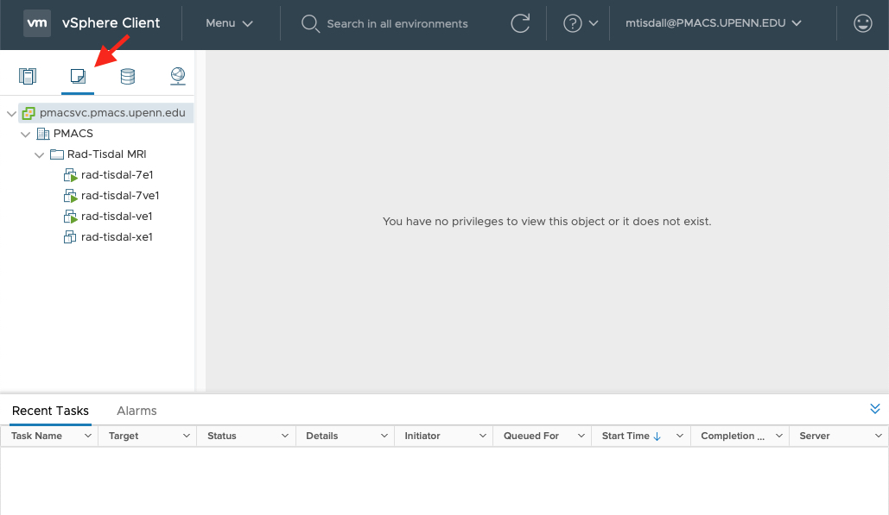
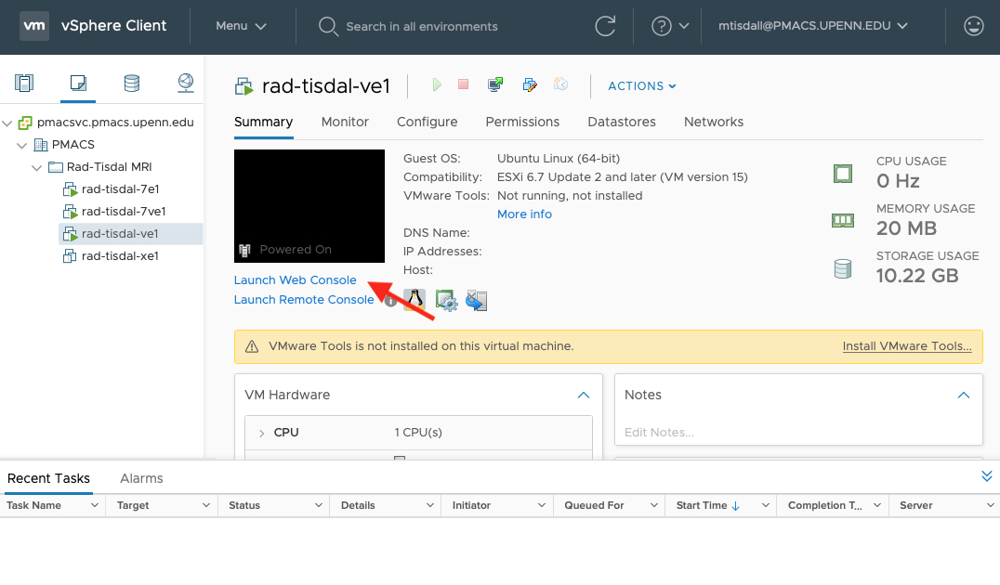

## Overview

The Siemens IDEA environment is being virtualized by PMACS, within their vSphere server environment. For each version of IDEA, you'll need to establish two VMs: one for the Windows environment, and one for the Linux environment. 

## Communicating with PMACS to make requests

Please use the PMACS ticket system [http://helpdesk.pmacs.upenn.edu]([http://helpdesk.pmacs.upenn.edu). In each section below where a ticket might be required, please use the exact ticket template provided. If your ticket seems to be not progressing, let Dylan know and he can contact Jerry at PMACS to help triage.

## Getting an account:

You'll first need a PMACS account (ask Dylan to file a ticket for you). Once you have that, you can enter the ticket system. To create a new user for the vSphere system (the management system for the VMs), file a ticket as follows:

* Ticket Description: New user setup for Robust Methods of Magnetic Resonance (RMMR)
* PennKey:
* Group: VPN-rad-tisdal

## Setting up a new virtual machine

### Instantiating the VMs
You'll need to request both the Windows and Linux VMs associated with the version of IDEA you'd like to have setup. For this, you can use a ticket like this:

* Ticket Description: New VM setup for Robust Methods of Magnetic Resonance (RMMR)
* Windows Operating System: Windows 10 or Windows 7
* Windows Template: *copy from list below*
* Linux Template: *copy from list below*

Here's a list of the templates associated with each IDEA verson

|IDEA Version	| Windows					| Linux 					|
| ----		| ----						| ----						|
| N4VE11C	| RAD-MRI_VE11C_Distribution_Win7_Template 	|  RAD-MRI_VE11C_linux_win7_20160120_mars	|
| NXVA30A	| RAD-MRI_XA30A_DistributionOVF_win10_Template 	|  RAD-MRI_XA30A_DistributionOVF_linux_win10_Template	|


### Connecting to the VPN

Go to: [https://remote.pmacs.upenn.edu](https://remote.pmacs.upenn.edu) to initiate a connection. If this is your first connection, you will need to install the Pulse Secure App Launcher.

### Connecting to the vSphere

[https://pmacsvc.pmacs.upenn.edu](https://pmacsvc.pmacs.upenn.edu)

List the available VMs by clicking on the VM list option.



Pick the Linux VM for the IDEA version you're instantiating, and then click on `Lauch Web Console`. 



You will see a pop-up, in which you again choose `Launch Web Console` (this may require disabling pop-up blockers). Version-specific instructions follow below.

### Configuring VE11C VMs

#### Linux VE11C

If you just get a black screen in the web console, tap any key to bring up the Linux login prompt.

Log in as `root`. It will not require a password.

We need to bring this machine's network connection online at the correct IP address. To do this, run:

```
ifconfig up eth0 <ip>
ifconfig eth0 netmask 255.255.255.0
```

where you should replace `<ip>` with the IP address you were assigned for this machine. If you don't know the IP address, file a ticket to request you get assigned one and add it to the table at the end of this document.

You can then close the web console for the linux system.

Note that if you need to restart the Linux VM for some reason, you'll need to run those two commands again in order to reconnect it to the network.

#### Windows VE11C

Using the same steps as above, now open the web console for the Windows version of the machine. 

Log in as user `IDEA` password `idea`

Enable sharing on `C:\MIDEA` for user IDEA.

Need to figure out firewall settings. For now, just disable the Windows Firewall.

You should now be able to both connect to this system via RDP and mount MIDEA via SMB. The username:password for both these interfaces is now `idea:idea`. From here on out, I like to do things via RDP, and not via the web console.

Start IDEA and run `externalmars true`. You'll be prompted for the IP address of the Linux machine, which you should enter. You should now be able to build the Linux binaries for a given sequence.

Stuff about config scripts goes here.

### Configuring XA30A VMs

#### Linux XA30A

If you just get a black screen in the web console, tap any key to bring up the Linux login prompt.

Log in as `root`. It will not require a password.

We need to bring this machine's network connection online at the correct IP address. To do this, run:

```
ifconfig up eth0 <ip>
ifconfig eth0 netmask 255.255.255.0
```

where you should replace `<ip>` with the IP address you were assigned for this machine. If you don't know the IP address, file a ticket to request you get assigned one and add it to the table at the end of this document.

You can then close the web console for the linux system.

Note that if you need to restart the Linux VM for some reason, you'll need to run those two commands again in order to reconnect it to the network.

#### Windows VE11C

Using the same steps as above, now open the web console for the Windows version of the machine. 

Log in with user `IDEA`, password `idea`

Enable sharing on `C:\MIDEA` for user IDEA. When asked if you want to update sharing settings for `C:\MIDEA\VirtualBox\` select `Don't change settings`.

Need to figure out firewall settings. For now, just disable the Windows Firewall.

You should now be able to both connect to this system via RDP and mount MIDEA via SMB. The username:password for both these interfaces is now `adminUser:idea`. From here on out, I like to do things via RDP, and not via the web console.

Start IDEA and run `externalmars true -ip <ip>`, replacing `<ip>` with the IP address of the Linux machine, which you should enter. You should now be able to build the Linux binaries for a given sequence.

Stuff about config scripts goes here.
## Resetting the virtual machines

If something goes wrong, you can always request PMACS to reset the VM. **THIS WILL ERASE EVERYTHING ON THE MACHINE** so make sure your code is committed and pushed to GitHub. To request a reset, please use the following ticket format:


* Ticket Description: Re-initialize VM for Robust Methods of Magnetic Resonance (RMMR)
* Name of VM(s) to delete
* Windows Operating System: Windows 10 or Windows 7
* Windows Template: *copy from list above* 
* Linux Template: *copy from list above*


## Assigned IP addresses

|	| VE11C Linux  | VE11C Win    | XA30A Linux  | XA30A Win    |
|-----  | -----        | -----        | ----         | -----        |
| dylan | 172.16.42.30 | 172.16.42.29 | 172.16.42.39 | 172.16.42.28 |
